# BP-015 - Коммерческий операционный цикл CrewPortGlobal

- Project: CrewPortGlobal.com
- Company: GTC INFORMATION TECHNOLOGY FZ-LLC
- Business-process ID: BP-015
- Source task: Project Owner approval after CPG-BIZ-051
- Baseline: BP-001, BP-002, BP-003, BP-008, BP-012, BP-013, BP-014
- Version: 1.2
- Date: 2026-06-19
- Document type: Controlling business-process manual
- Status: Drafted for Project Owner review

## 1. Назначение

Этот документ описывает полный коммерческий операционный цикл CrewPortGlobal: от маркетингового привлечения моряков и судовладельцев до оказания услуги, фиксации доказательной базы, выставления счетов и повторного цикла после рейса.

Документ нужен для того, чтобы сайт и приложение перестали быть набором описательных страниц и стали системой автоматизации работы участников:

```text
моряк получает работу
судовладелец получает экипаж
GTC INFORMATION TECHNOLOGY FZ-LLC получает доказанную B2B-основу для вознаграждения
```

BP-015 не заменяет BP-012. BP-012 описывает операционный процесс формирования экипажа. BP-015 расширяет его до полного коммерческого цикла компании, включая маркетинг, пакеты услуг, расчеты, повторное привлечение и управление жизненным циклом клиента.

## 2. Управляющий принцип

CrewPortGlobal не должен развиваться как учебный или описательный сайт о crewing.

Публичные страницы допустимы только если они выполняют одну из функций:

1. привлекают моряка или работодателя к регистрации;
2. показывают реальные данные платформы без раскрытия контактов;
3. объясняют юридически значимые условия, согласия или no-fee boundary;
4. ведут пользователя к функциональной форме или кабинету;
5. поддерживают доверие, аудит или compliance.

Все остальные страницы должны быть проверены и либо объединены, либо удалены, либо перенесены в справочный раздел.

Функциональные страницы должны быть связаны с бизнес-процессом:

```text
business stage -> working object -> computed task -> evidence -> next stage
```

## 3. Внешние ориентиры рынка

Для ориентации использованы открытые страницы крупных участников maritime crew management рынка. Они показывают, что коммерческая ценность обычно находится не в описательных страницах, а в пакетах услуг: crew management, payroll, travel, training, compliance, documentation, reporting and crew-change coordination.

Reference links:

1. Columbia Group - Crew Management: https://columbiagroup.org/service/crew-management/
2. Viking Crew - Management services: https://www.vikingcrew.com/management/
3. ILO - Maritime Labour Convention, 2006: https://www.ilo.org/international-labour-standards/maritime-labour-convention-2006

Эти источники не являются тарифным листом CrewPortGlobal. Они используются как подтверждение рыночной логики: работодатель платит за управляемый B2B-сервис, а моряк не должен платить за доступ к трудоустройству или подбор.

## 4. Коммерческая модель Stage 1

Stage 1 должен поддерживать комбинированную модель.

| Commercial component | Meaning | Trigger | Evidence | Notes |
|---|---|---|---|---|
| Client onboarding package / subscription | Начало сотрудничества, доступ к сервису, проверка клиента, базовый набор услуг | Судовладелец выбирает пакет и принимает условия | Service agreement, package record, payment/entitlement status | Пакет может давать скидку не менее 10% на набор услуг из прайса. |
| Crew request processing fee | Оплата предварительной работы по конкретной заявке | Работодатель подтверждает: `беру / proceed with candidate` | Employer decision, candidate presentation record, request-processing record | Не следует брать оплату только за пустую заявку без результата. |
| Embarkation success fee | Вознаграждение после фактической посадки моряка | Моряк взошел на борт | Embarkation confirmation, vessel/position/date evidence | Контроль посадки становится обязательным этапом. |
| Monthly actual service fee | Ежемесячное начисление за фактический период работы моряка | Моряк работает на судне в расчетном периоде | Monthly service confirmation, vessel feedback, payroll/work evidence | Учитывает болезнь, досрочное списание, замену, неполный месяц. |
| Disembarkation and return support | Сопровождение схода с судна и возвращения моряка до согласованного пункта | Контракт завершается, моряк списывается или требуется досрочное возвращение | Disembarkation confirmation, repatriation / travel responsibility, destination and support notes | Должно быть известно до окончания контракта; источник - контракт, работодатель, агент или подтвержденные инструкции. |
| Replacement continuity rule | Срочная замена при неотработке или выбытии | Моряк не может продолжать работу | Disembarkation/replacement reason, replacement request | Может быть включено в пакет, оплачено отдельно или предоставлено со скидкой. |
| Optional services | Дополнительные услуги | Отдельное согласование услуги | Service order, acceptance, invoice | Payroll cashier, logistics, visa/doc support, medical coordination, training, crew rotation. |

No-fee control:

```text
Моряк не оплачивает подбор, трудоустройство или доступ к вакансиям.
```

Любые optional seafarer services должны быть добровольными, отделенными от трудоустройства и не влияющими на доступ к matching.

## 4A. Рамочный договор и коммерческие условия

CrewPortGlobal должен разделять два разных слоя:

```text
рамочный договор присоединения
!=
коммерческое согласование конкретной услуги
```

Рамочный договор присоединения фиксирует правовые условия работы: полномочия, ограничения, no-fee boundary, ответственность, уведомления, отзыв полномочий, audit/control route и правила платформенного контроля.

Коммерческие условия конкретной услуги фиксируются отдельно:

1. Service Order;
2. коммерческим приложением;
3. заявкой;
4. отдельным подписанным ценовым приложением;
5. утвержденным price-basis record.

Акцепт рамочного договора не должен создавать billing basis, success fee, SLA-штраф/бонус или обязательство оплаты конкретной услуги. До отдельного коммерческого согласования услуга остается в статусе:

```text
commercial_terms_pending
free_until_commercial_agreement
non_billable_representative_management
```

Это позволяет сторонам быстро присоединиться к правовой рамке платформы без навязывания коммерческих условий.

## 4B. Единый договорный workspace для разных договоров

Коммерческий процесс должен использовать тот же договорный механизм, что и прямой договор моряк-судовладелец.

Разные договоры выбираются не отдельными скриптами, а через:

```text
contract_kind
+ approved template_code/version
+ source adapter
+ appendix/evidence checklist
+ party approvals
+ generated snapshot/hash
```

Минимальный набор `contract_kind`:

| Contract kind | Commercial/process role |
|---|---|
| `seafarer_shipowner_employment` | Direct SEA / employment-support agreement; not a billing agreement with the seafarer. |
| `shipowner_agent_framework` | Shipowner-side representative management and authority; paid service remains separate until Service Order / commercial addendum / request. |
| `seafarer_agent_representation` | Optional seafarer-side representation; must preserve no-fee boundary and personal account/representative governance rights. |

The commercial group must not activate billing, success fee, SLA penalty/bonus or invoice basis from a framework agreement alone.

Service Order, commercial addendum, request or approved price-basis record may be linked as an appendix/evidence item in the contract workspace, but it remains a separate commercial document with its own acceptance and billing guard.

## 5. Круговой процесс компании

```mermaid
flowchart LR
  M[Marketing attraction] --> R[Registration and identity]
  R --> V[Verification and authority]
  V --> P[Service package / entitlement]
  P --> D[Demand and vessel intake]
  D --> S[Supply readiness]
  S --> X[Request-supply matching]
  X --> L[Shortlist and presentation]
  L --> A[Employer proceeds with candidate]
  A --> E[Embarkation confirmation]
  E --> W[Monthly work/service evidence]
  W --> H[Disembarkation and return support]
  H --> B[Billing and revenue attribution]
  B --> C[Service cycle closure]
  C --> F[Seafarer follow-up and availability refresh]
  C --> G[Employer retention and repeat request]
  F --> M
  G --> M
```



Упрощенно:

```text
Привлечь
-> зарегистрировать
-> проверить
-> оформить пакет услуг
-> получить заявку и контекст судна
-> сопоставить спрос и предложение
-> представить кандидатов
-> подтвердить выбор и посадку
-> фиксировать фактическую работу
-> сопровождать сход с судна и возвращение моряка
-> выставить счет
-> закрыть цикл
-> вернуть моряка и работодателя в новый цикл
```

## 6. Stage Matrix

| Code | Stage | Main object | Responsible group | Computed task | Output |
|---|---|---|---|---|---|
| CC-01 | Marketing to seafarers | Seafarer lead | Group 0 / Group 2 | Qualify seafarer lead | Candidate invited to registration or follow-up. |
| CC-02 | Marketing to employers | Employer lead | Group 0 / Group 1 | Qualify employer-side demand | Employer-side lead routed to client registration. |
| CC-03 | Person registration | Physical person / service account | Registration flow / support | Complete account registration | Authenticated user with path selection. |
| CC-04 | Seafarer profile completion | Seafarer supply card | Seafarer / Group 2 | Complete profile and documents | Profile ready for operator review or correction. |
| CC-05 | Employer registration | Employer/company card | Employer / Group 1 | Complete employer authority data | Employer account ready for verification. |
| CC-06 | Vessel registration | Vessel context card | Employer / Group 1 | Complete vessel context | Vessel context usable for crew request. |
| CC-07 | Client verification | Employer/vessel/authority evidence | Group 5 | Review authority and vessel evidence | Authorized or correction-required client context. |
| CC-08 | Framework agreement and commercial terms setup | Framework agreement, authority package, Service Order / commercial addendum | Group 3 / Group 5 / represented participant | Confirm framework terms and commercial basis | Framework terms accepted; authority may proceed; paid service active only after Service Order / commercial addendum or commercial follow-up task. |
| CC-09 | Crew request intake | Vacancy / crew request | Employer / Group 1 | Complete crew request | Structured demand ready for matching. |
| CC-10 | Matching preparation | Demand plus supply | Review team | Review request-supply comparison | Candidate blockers and fit explanation visible. |
| CC-11 | Internal shortlist | Shortlist draft | Review team | Create / approve internal shortlist | Approved internal candidate set. |
| CC-12 | Candidate presentation | Presentation review | Review team / Group 5 | Present approved candidate summary | Employer receives controlled candidate information. |
| CC-13 | Employer decision | Crew request / candidate decision | Group 1 / Review team | Record employer decision | Proceed, reject, request alternative or hold. |
| CC-14 | Contract and embarkation control | Employment/service support record | Group 1 / Group 4 / Group 5 | Confirm contract, joining logistics and boarding evidence | Employment pending, onboard-active status, success-fee trigger or blocker/replacement task. |
| CC-15 | Monthly service evidence | Work period record | Group 4 / Group 3 | Confirm monthly service evidence | Invoice basis for actual worked period. |
| CC-16 | Disembarkation and return support | Return / repatriation record | Group 4 / responsible manager | Confirm disembarkation and return arrangement | Return completed, replacement required, or support exception. |
| CC-17 | Billing and revenue attribution | Billing/service completion record | Group 3 | Prepare invoice and attribution | Invoice/payment/revenue record. |
| CC-18 | Replacement or closure | Service cycle record | Group 1 / Group 4 / Review team | Replace, close or schedule follow-up | Replacement workflow or service closure. |
| CC-19 | Retention and repeat marketing | Client and seafarer lifecycle | Responsible manager / Group 0 / Group 2 | Schedule next contact and update seafarer availability | Employer and seafarer return to the next cycle. |

## 7. Evidence Matrix

| Stage | Evidence required | Audit event / record |
|---|---|---|
| Marketing lead | Source channel, campaign, referral, contact note | `lead_captured`, source attribution |
| Registration | Account identity, e-mail confirmation, selected path | `registration_created`, `email_verified` |
| Seafarer profile | Structured profile, documents, consent, no-fee acknowledgement | `profile_saved`, `submit_review_requested` |
| Employer/company | Company data, representative authority, registration documents | `employer_authority_reviewed` |
| Vessel | Vessel type, flag, particulars, evidence documents | `vessel_context_reviewed` |
| Framework agreement | Accepted standard legal terms, authority/POA status, notification record | `framework_terms_accepted`, `authority_recorded` |
| Commercial terms | Service Order / commercial addendum / request, tariff or price basis, payer, payment terms, SLA where applicable | `service_order_accepted`, `commercial_terms_accepted`, `service_entitlement_created` |
| Crew request | Rank, department, vessel type, joining date, salary, requirements | `crew_request_submitted`, `demand_structured` |
| Matching | Candidate comparison, blockers, safe summary | `matching_reviewed` or computed read event if required |
| Shortlist | Internal draft, approval guard, approval decision | `shortlist_draft_created`, `shortlist_approved_internal` |
| Presentation | Employer-safe candidate payload, human approval | `candidate_presented_to_employer` |
| Employer proceeds | Employer confirms candidate interest or acceptance | `employer_candidate_decision_recorded` |
| Contract and joining logistics | Contract, vessel, position, joining date, travel/repatriation responsibility, return destination | `employment_contract_verified`, `joining_logistics_recorded` |
| Embarkation | Boarding date, vessel, position, proof from employer/vessel/source | `embarkation_confirmed` |
| Monthly service | Period worked, status, illness/disembarkation/replacement signals | `monthly_service_confirmed` |
| Disembarkation / return | Disembarkation date, reason, return route, destination, responsible payer, support completion | `disembarkation_confirmed`, `seafarer_return_completed` |
| Billing | Invoice, payment status, service-fee basis, attribution | `invoice_prepared`, `payment_recorded` |
| Closure / repeat | Outcome, next-contact date, next voyage availability | `service_cycle_closed`, `retention_task_created`, `availability_refresh_requested` |

## 8. Page And Workspace Alignment

Every active page must map to a process stage.

| Page / workspace | Process role | Keep / change direction |
|---|---|---|
| `/` | Public entry with real platform indicators and role CTAs | Keep, make functional and compact. |
| `/for-seafarers/` | Seafarer acquisition page | Keep only if it sends to registration/profile and avoids educational filler. |
| `/for-shipowners/` | Employer acquisition page | Keep only if it sends to employer registration/request and explains B2B service value compactly. |
| `/how-it-works/` | Process trust page | Keep only as short visual process map; avoid long explanations. |
| `/vacancies/` | Public or authenticated vacancy visibility | Keep as functional vacancy/request surface, not text page. |
| `/create-profile/` | Seafarer supply profile and consent | Keep as primary seafarer functional workspace. |
| `/post-vacancy/` | Employer, vessel and crew request intake | Keep as primary employer functional workspace until cabinet routes replace it. |
| `/team/` | Computed tasks and assigned work | Keep as internal task execution surface. |
| `/team/matching/` | Request-supply comparison | Keep as internal matching explanation surface. |
| `/team/shortlists/` | Internal shortlist history/detail | Keep as team control surface. |
| `/team/documents/` | Protected document review | Keep as team evidence surface. |
| `/team/registry/` | Safe registry detail | Keep as internal/investor demo control surface. |
| `/verify/` | Transitional operator workspace | Keep until replaced by cabinet/team object workspaces. |
| `/cabinet/` | Authenticated personal workspace | Target home for user-specific tasks. |
| Legal pages | Contract, privacy, no-fee, complaints, service terms | Keep as Trust Center, not marketing filler. |
| Descriptive duplicate pages | Any page without stage/object/task/legal purpose | Review for merge/delete. |

## 9. Production Logic

The company production process is not page publication. Production is the controlled movement of records:

```text
lead
-> person/account
-> employer/seafarer/vessel/request card
-> evidence
-> verified data
-> matching explanation
-> reviewed shortlist
-> employer decision
-> embarkation proof
-> monthly service evidence
-> disembarkation / return support evidence
-> invoice basis
-> retention plan
```

Each stage must create at least one of:

1. a validated record;
2. a computed task;
3. an audit event;
4. evidence for service delivery;
5. a commercial entitlement or billing basis;
6. a future retention task.

If a page or workflow does none of these, it is not part of the production process.

## 10. Functional Menu Principle

The public menu should eventually be reduced to role-based action entries:

```text
Home
For Seafarers
For Employers
Vacancies
Documents / Trust Center
Login / Cabinet
Team
```

During audit, the full site-map menu may remain visible so the Project Owner can find and classify all pages.

After audit, the public user should not see all service/internal pages in the main navigation.

## 11. KPI And Controls

| Area | Control indicator |
|---|---|
| Marketing | Lead source, conversion rate, stale lead count, next-contact completion. |
| Registration | Registration completion rate, duplicate rate, incomplete profile/request count. |
| Data quality | Missing mandatory fields, document rejection rate, correction-cycle count. |
| Matching | Number of match-ready requests, candidates with blockers, shortlist conversion. |
| Employer value | Time from request to shortlist, employer proceed rate, replacement rate. |
| Embarkation | Confirmed boarding count, boarding proof completeness, failed boarding reasons. |
| Billing | Invoice timeliness, actual work-period confirmation, payment follow-up state. |
| Retention | Repeat request rate, returning seafarer availability updates, next-contact coverage. |
| Compliance | No-fee evidence, consent completeness, scoped visibility, audit trail completeness. |

## 12. Replacement And Continuity Rule

If a seafarer cannot complete the expected contract period, the system must not treat the service as simply completed.

The process must determine:

1. whether the reason is medical, family, operational, employer-side, disciplinary, documentation or force majeure;
2. whether the package includes replacement without extra fee;
3. whether replacement is billable, discounted or included;
4. whether the original monthly fee must be adjusted by actual worked days;
5. whether the seafarer remains available for a later voyage;
6. whether a new matching cycle must start immediately.

Replacement creates a high-priority computed task for the responsible group.

## 13. Seafarer Voyage Escort And Return Rule

CrewPortGlobal's service cycle must not stop at candidate presentation or even at embarkation. If GTC INFORMATION TECHNOLOGY FZ-LLC supports crew formation for a vessel, the operational cycle includes:

```text
contract context
-> joining logistics
-> boarding confirmation
-> active voyage / monthly service evidence
-> expected contract end monitoring
-> disembarkation confirmation
-> return / repatriation support
-> availability refresh
-> next voyage marketing
```

The seafarer status must be computed from evidence, not manually selected as a free-form label.

| Computed status | Required evidence | Main visible task |
|---|---|---|
| `employment_pending_contract` | Employer proceeds with candidate, but no verified contract/support record exists | Record employment contract and joining conditions. |
| `employment_pending_embarkation` | Contract is verified, joining date/logistics exist, boarding is not confirmed | Confirm boarding / joining evidence. |
| `onboard_active` | Boarding evidence exists and disembarkation is not confirmed | Confirm monthly service evidence. |
| `return_preparation_due` | Contract end date or early disembarkation signal is approaching and return arrangement is missing or stale | Confirm disembarkation and return arrangement. |
| `return_in_progress` | Disembarkation is confirmed, but return/support completion is not confirmed | Complete seafarer return support. |
| `available_update_due` | Return is completed or contract has ended and availability is stale | Ask seafarer to update next voyage availability. |

The contract or employment-support document should capture:

1. employer / shipowner;
2. vessel;
3. seafarer;
4. rank / position;
5. joining date and place;
6. expected contract duration or end date;
7. travel and joining responsibility;
8. disembarkation and repatriation responsibility;
9. return destination or agreed place;
10. replacement / early termination terms;
11. payroll or service-period evidence requirements where applicable.

### 13.1 Pre-Contract Terms Before Candidate Acceptance

Contract-critical conditions should be collected before the final employment/support contract is generated.

The employer / shipowner crew request should include structured preliminary terms:

1. joining place;
2. joining travel responsibility;
3. joining travel payer;
4. expected contract duration;
5. expected contract completion / disembarkation conditions;
6. repatriation / return responsibility;
7. return destination or acceptable return-point rule;
8. replacement / early termination rule;
9. monthly service or work-period evidence expected from the employer;
10. unresolved items marked as `to_be_agreed`.

The seafarer profile should include matching and negotiation preferences:

1. preferred joining location or travel limitation;
2. return destination;
3. preferred return responsibility model;
4. willingness to accept employer-arranged travel;
5. willingness to accept self-arranged travel where reimbursed or separately agreed;
6. unresolved preferences marked as `to_be_agreed`.

The value `to_be_agreed` is allowed during profile and request preparation. It means the condition is known to be important but has not yet been finally agreed.

Before contract generation or final contract confirmation, `to_be_agreed` fields must be either:

1. resolved into explicit terms; or
2. recorded as a controlled exception with human approval and clear responsibility.

The future platform contract workflow should use already collected structured data:

```text
verified employer
+ verified vessel
+ structured crew request
+ selected seafarer profile
+ agreed joining / return / replacement / billing terms
= draft contract / employment-support agreement on the portal
```

The public or authenticated vacancy preview may show safe preliminary terms, for example:

```text
joining place
expected contract duration
travel responsibility
return responsibility
items to be agreed
```

This makes the vacancy transparent without exposing restricted personal or commercial details.

The future contract process must be treated as its own controlled stage:

```text
pre-contract terms
-> draft generated from platform data
-> party review
-> unresolved terms resolved
-> ready for signature
-> signed pending embarkation
-> onboard active
```

Contract generation may be assisted by an agent, but the agent must select values from approved catalogs or clearly mark unresolved fields. The agent must not invent wage, travel, return or CBA terms outside party-confirmed data.

The seafarer-facing profile should therefore support two lifecycle states in addition to ordinary availability:

```text
working_onboard
return_support_required
```

After return completion, the next computed seafarer task should not be generic marketing. It should be practical care:

```text
Update availability and next voyage preference.
(Seafarer profile: {rank}, last vessel {safe vessel summary}.)
```

This creates long-term retention without charging the seafarer recruitment or placement fees.

## 14. AI Agent Boundary

AI agents may assist with:

1. lead classification;
2. document extraction suggestions;
3. missing-field explanation;
4. demand-supply comparison summaries;
5. blocker explanation;
6. candidate presentation draft summaries;
7. monthly evidence checklist preparation;
8. invoice-basis draft summaries;
9. retention timing suggestions.

AI agents must not:

1. promise employment;
2. approve final hiring;
3. approve seafarer documents without human control;
4. set final prices or discounts;
5. issue invoices independently;
6. confirm payment independently;
7. bypass no-fee controls;
8. expose restricted data outside scoped visibility.

## 15. ISO / Audit Alignment

This process follows the same documented-information logic already used in BP-012 and BP-013:

| ISO-style element | CrewPortGlobal interpretation |
|---|---|
| Process owner | Project Owner / responsible business owner for the end-to-end cycle. |
| Inputs | Lead, profile, company, vessel, request, documents, consent, framework terms, authority evidence and commercial terms where a paid service is requested. |
| Activities | Registration, verification, matching, review, presentation, boarding, voyage support, disembarkation/return support, service confirmation, billing. |
| Outputs | Verified records, framework acceptance, commercial service order where needed, candidate presentation, embarkation/return evidence, service evidence, invoice basis, retention task. |
| Records | Cards, documents, audit events, decisions, evidence, billing records. |
| Controls | Human approval, no-fee rule, scoped visibility, completeness gate, correction route. |
| Improvement | Describe process, verify in application, correct, test, then proceed. |

## 16. Next Implementation Planning

The next process-controlled stage should be:

```text
CPG-BIZ-053 - Functional page inventory against BP-015 commercial operating cycle
```

The purpose:

1. open every page from the temporary full site menu;
2. map it to BP-015 stage, object and task;
3. classify each page as keep, merge, replace, move to cabinet or delete;
4. remove descriptive water from public pages;
5. keep only functional pages and necessary legal/trust documents;
6. prepare the final public/authenticated navigation model.

No code changes should be made from BP-015 alone. Page changes should follow the next approved inventory task.

## 17. Revision History

| Version | Date | Author | Changes |
|---|---|---|---|
| 1.2 | 2026-06-19 | GTC IT / AI Assistant | Added unified contract workspace rule for commercial/framework agreements and clarified Service Order/addendum linkage as separate appendix/evidence with billing guard |
